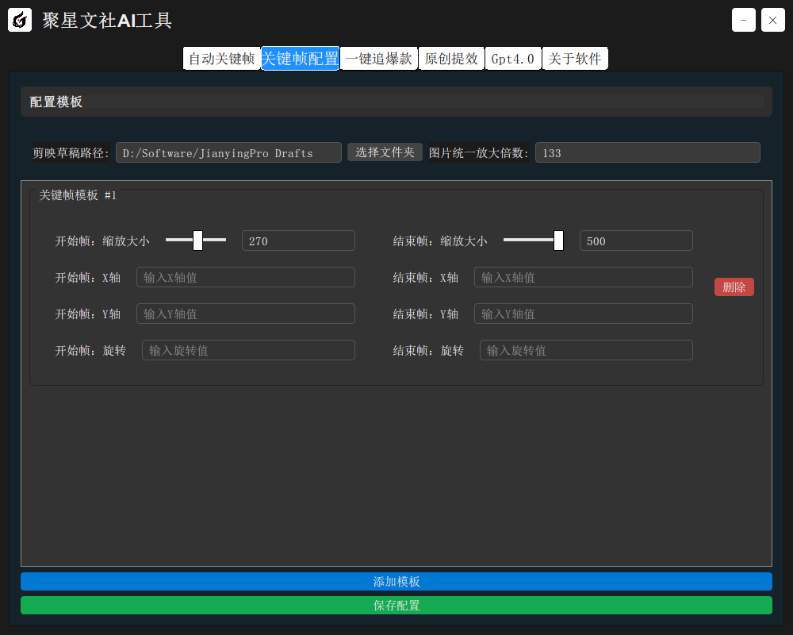
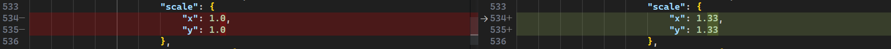
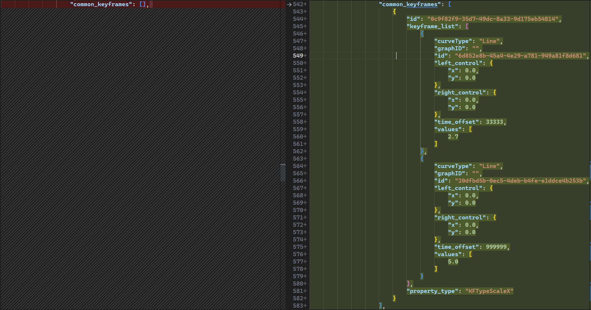

# 剪映关键帧修改原理

> 剪映的工程文件由一系列`json`文件以及缓存文件组成，最重要的文件为各项目文件夹根目录的`draft_content.json`文件。



参考工具设置如上

## 整体缩放


```json
// draft_content.json->tracks[]->segments[]->
// *各个子节点的*scale
// 此值为已有值，修改即可
"scale": {
    "x": 1.0,
    "y": 1.0
},
```



## 增加起始帧、结尾帧

```json
// draft_content.json->tracks[]->segments[]->
// *各个子节点的*"common_keyframes"数组，原值为空数组
// 每个帧为一个json对象
"common_keyframes": [
    {
        "id": "0c9f82f9-35d7-49dc-8a33-9d175eb54814",
        "keyframe_list": [
            {
                "curveType": "Line",
                "graphID": "",
                "id": "6d852e8b-45a4-4e29-a781-949a81f8d681",
                "left_control": {
                    "x": 0.0,
                    "y": 0.0
                },
                "right_control": {
                    "x": 0.0,
                    "y": 0.0
                },
                "time_offset": 33333,
                "values": [
                    2.7 // 起始帧缩放
                ]
            },
            {
                "curveType": "Line",
                "graphID": "",
                "id": "20dfbd5b-0ec5-4deb-b4fe-e1ddce4b253b",
                "left_control": {
                    "x": 0.0,
                    "y": 0.0
                },
                "right_control": {
                    "x": 0.0,
                    "y": 0.0
                },
                "time_offset": 999999,
                "values": [
                    5.0 // 结尾帧缩放
                ]
            }
        ],
        "property_type": "KFTypeScaleX"
    }
]
```


